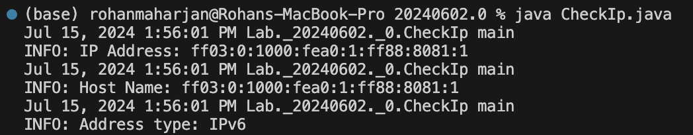

# Program for check whether inputted ip is ipV4 or ipV6.

**Name**: Program for check whether inputted ip is ipV4 or ipV6.

**Date**: July 15th, 2024

## Source Code

```java
package Lab._20240602._0;

import java.net.*;
import java.util.logging.*;

public class CheckIp {
    private static final Logger logger = Logger.getLogger(CheckIp.class.getName());

    public static void main(String[] args) {
        try {
            InetAddress address = InetAddress.getByName("FF03:0000:1000:FEA0:0001:FF88:8081:0001");
            // InetAddress address = InetAddress.getByName("www.google.com");
            logger.info("IP Address: " + address.getHostAddress());
            logger.info("Host Name: " + address.getHostName());

            byte[] add = address.getAddress();
            if (add.length == 4) {
                logger.info("Address type: IPv4");
            } else if (add.length == 16) {
                logger.info("Address type: IPv6");
            } else {
                logger.warning("Unknown address type");
            }
        } catch (UnknownHostException e) {
            logger.severe("Could not find address");
        }
    }
}
```

## Output


