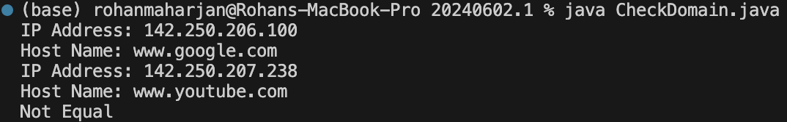
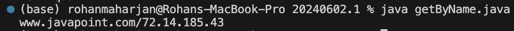

# Program for Checking Domain using InetClass and comparing two different domain names.

**Name**: Program for Checking Domain using InetClass and comparing two different domain names.

**Date**: August 9th, 2024

## Source Code

```java
package Lab._20240602._1;

import java.net.*;

public class CheckDomain{
    public static void main(String[] args) {
        try {
            InetAddress a = InetAddress.getByName("www.google.com");
            InetAddress b = InetAddress.getByName("www.youtube.com");

            System.out.println("IP Address: " + a.getHostAddress());
            System.out.println("Host Name: " + a.getHostName());

            System.out.println("IP Address: " + b.getHostAddress());
            System.out.println("Host Name: " + b.getHostName());

            if(a.equals(b)){
                System.out.println("Equal");
            }else{
                System.out.println("Not Equal");
            }
            
        } catch (UnknownHostException e) {
            System.out.println("Could not find address ");
        }
    }
}
```

## Output



# Program for Check Domain using method getbyname.

**Name**: Program for Check Domain using method getbyname.

**Date**: August 9th, 2024

## Source Code

```java
package Lab._20240602._1;

import java.net.*;

public class getByName {
    public static void main(String[] args) {
        try {
            InetAddress address = InetAddress.getByName(
                    "www.javapoint.com");
            System.out.println(address);

        } catch (UnknownHostException ex) {
            System.out.println("Javapoint couldn\'t be found");
        }
    }
}
```

## Output


