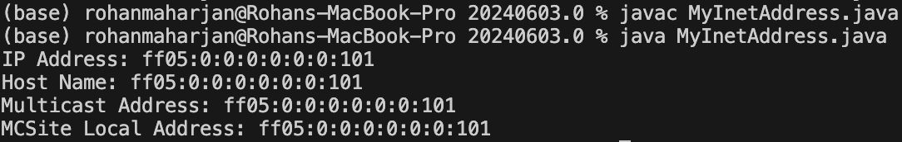
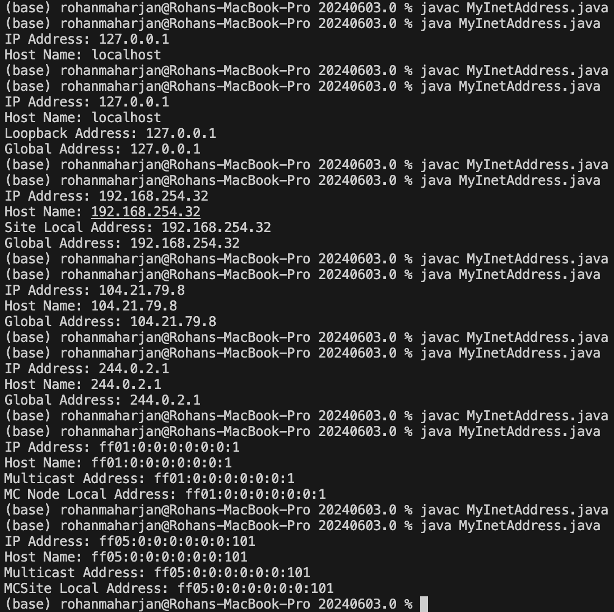

# Program for Implementing InetAddress Class and checking characteristics of a given IP address

**Name**: Program for Implementing InetAddress Class and checking characteristics of a given IP address

**Date**: August 22th, 2024

## Source Code

```java
package Lab._20240603._0;

import java.net.*;

public class MyInetAddress {
    public static void main(String[] args) {
        try {
            InetAddress a = InetAddress.getByName("FF05:0:0:0:0:0:0:101");

            System.out.println("IP Address: " + a.getHostAddress());
            System.out.println("Host Name: " + a.getHostName());

            // checking Characteristics of an Ip Address
            if(a.isLoopbackAddress()){
                System.out.println("Loopback Address: " + a.getHostAddress());
            }
            if(a.isLinkLocalAddress()){
                System.out.println("Link Local Address: " + a.getHostAddress());
            }
            if(a.isSiteLocalAddress()){
                System.out.println("Site Local Address: " + a.getHostAddress());
            }
            if(a.isMulticastAddress()){
                System.out.println("Multicast Address: " + a.getHostAddress());
                if(a.isMCOrgLocal()){
                    System.out.println("MCOrgLocal Address: " + a.getHostAddress());
                }
                if(a.isMCSiteLocal()){
                    System.out.println("MCSite Local Address: " + a.getHostAddress());
                }
                if(a.isMCLinkLocal()){
                    System.out.println("MC Link Local Address: " + a.getHostAddress());
                }
                if(a.isMCNodeLocal()){
                    System.out.println("MC Node Local Address: " + a.getHostAddress());
                }
            } else {
                System.out.println("Global Address: " + a.getHostAddress());
            }

        } catch (UnknownHostException e) {
            System.out.println("Could not find address");
        }
    }
}

```

## Output



## Output for more characteristics of a given IP address


