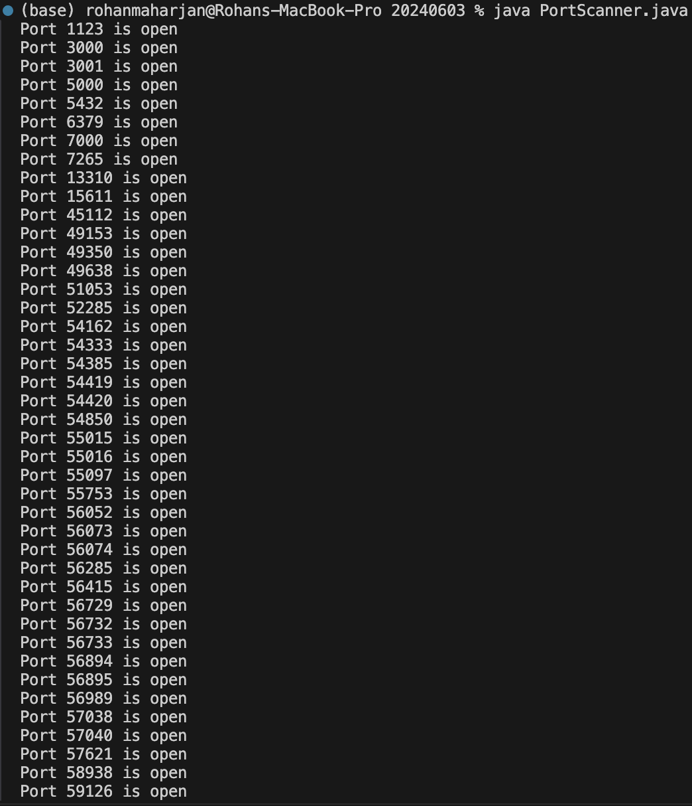

# Program for Implementing of port scanner.

**Name**: Program for Implementing of port scanner.

**Date**: August 14th, 2024

## Source Code

```java
package Lab._20240603;

import java.net.*;

public class PortScanner {
    public static void main(String[] args) {
        String host = "localhost";
        int minPort = 1;
        int maxPort = 65535;

        try {
            InetAddress inetAddress = InetAddress.getByName(host);

            for (int port = minPort; port <= maxPort; port++) {
                try (Socket socket = new Socket()) {
                    socket.connect(new InetSocketAddress(inetAddress, port), 1000);
                    System.out.println("Port " + port + " is open");
                } catch (Exception e) {
                    // System.out.println("Connection is closed.");
                }
            }
        } catch (UnknownHostException e) {
            System.out.println("Unknown host: " + host);
        }
    }
}
```

## Output


